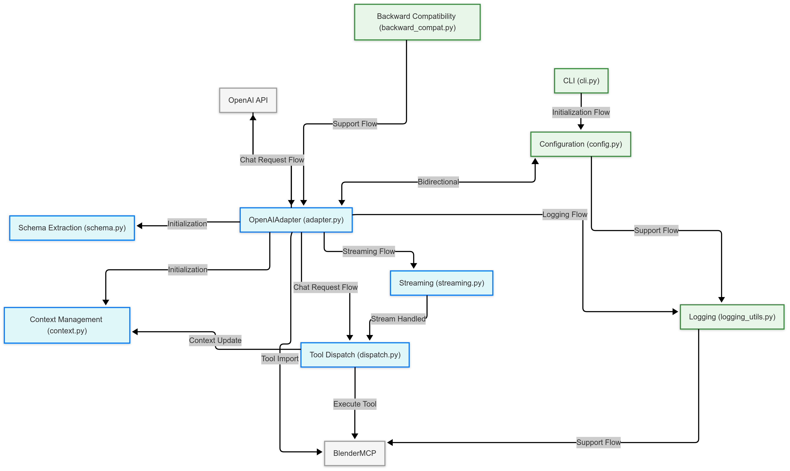

# BlenderMCP OpenAI Adapter Architecture

This document explains the architecture and design decisions of the BlenderMCP OpenAI adapter.

## Design Philosophy

The adapter was designed with the following principles in mind:

1. **Non-invasive integration**: The adapter should work without modifying the original BlenderMCP codebase, ensuring compatibility as the core project evolves.
2. **Modularity**: The code should be organized into logical modules with clear separation of concerns.
3. **Robustness**: The adapter should handle errors gracefully and provide meaningful feedback.
4. **Configurability**: The adapter should support various configuration options to meet different use cases.
5. **Extensibility**: The architecture should allow for easy extension with new features.

## System Components

### Core Components

based on: Editor _ Mermaid Chart-2025-05-01-161004_BlenderMCP OpenAI Adapter Architecture.mmd

#### 1. OpenAIAdapter (`adapter.py`)

The central class that coordinates all components. It handles:
- Initialization of the OpenAI client
- Dynamic import of the BlenderMCP server
- Extraction of tools schema from MCP
- Chat completion requests and responses
- Tool call execution and response processing

#### 2. Schema Extraction (`schema.py`)

Responsible for converting BlenderMCP tool functions into OpenAI function schemas:
- Analyzes Python function signatures using type hints
- Extracts parameter types, defaults, and descriptions from docstrings
- Generates JSON schema for OpenAI function calling
- Supports complex types including generics, unions, and optionals

#### 3. Context Management (`context.py`) 

Handles the context objects used by MCP tools:
- Creates proper context objects instead of empty mocks
- Tracks session state across multiple tool calls
- Manages context lifecycle and resource cleanup
- Provides compatibility with different MCP server versions

#### 4. Tool Dispatch (`dispatch.py`)

Manages the execution of tools and error handling:
- Finds the appropriate tool function from the tool name
- Creates a proper context for the tool
- Executes the tool with the given parameters
- Handles and structures errors during execution
- Formats tool results for OpenAI API

#### 5. Streaming (`streaming.py`)

Handles streaming responses with tool call support:
- Processes streaming chunks from OpenAI
- Accumulates and processes tool call deltas
- Executes tools when they appear mid-stream
- Yields text content to the caller

### Supporting Components

#### 1. Configuration (`config.py`)

Manages adapter configuration:
- Model parameters (model, temperature, etc.)
- Adapter settings (logging, connection)
- Supports loading from and saving to JSON files
- Handles environment variables and command-line overrides

#### 2. Logging (`logging_utils.py`)

Provides structured logging:
- Configurable log levels and destinations
- Support for both text and JSON formats
- Context-aware logging with session information
- Debug logging for development

#### 3. Command-line Interface (`cli.py`)

Provides a user-friendly interface:
- Parses command-line arguments
- Creates configuration objects
- Sets up the environment
- Initializes and runs the adapter

#### 4. Backward Compatibility (`backward_compat.py`)

Ensures compatibility with existing code:
- Provides a drop-in replacement for the original script
- Maintains the same command-line interface
- Routes to the new modular implementation

## Module Interactions

1. **Initialization Flow**:
   - CLI parses arguments and creates configuration
   - OpenAIAdapter imports MCP server and extracts schemas
   - Schema extractor builds function definitions

2. **Chat Request Flow**:
   - Adapter receives a chat request
   - OpenAI API generates a response with tool calls
   - Tool dispatcher executes the tools
   - Streaming module processes the response

3. **Error Handling Flow**:
   - Tool dispatcher catches and structures errors
   - Errors are logged and returned to the model
   - Model generates a response based on the error

## Extensibility

The modular architecture allows for easy extension:

1. **New Tool Support**: As BlenderMCP adds new tools, they are automatically detected and exposed to OpenAI.
2. **Additional Models**: The adapter can be extended to support other models by creating new adapters.
3. **Enhanced Schemas**: The schema extraction can be extended to support more complex types.
4. **Custom Tool Execution**: The tool dispatcher can be extended to support custom execution strategies.

## Dependencies

The adapter has minimal dependencies:
- `openai`: For communication with OpenAI API
- `docstring-parser`: For extracting parameter descriptions from docstrings
- `jsonschema`: For schema validation

## Deployment

The adapter can be deployed in various ways:
1. As a standalone Python package
2. Integrated with Claude Desktop or Cursor
3. Embedded in other applications

## Performance Considerations

The adapter is designed to be efficient:
- Schemas are extracted once at initialization
- Context objects are reused when possible
- Streaming responses reduce initial latency
- Tool calls are executed efficiently with proper contexts 